# 集群管理模块 - 接口调用流程图

## 1. 集群管理主页面数据加载流程

```mermaid
graph TD
    A[用户进入集群管理页面] --> B[初始化组件状态]
    B --> C[默认激活概览标签页]
    C --> D[调用 loadTabData('overview')]
    D --> E[检查API锁状态]
    E -->|未锁定| F[设置API锁]
    E -->|已锁定| G[跳过重复调用]
    F --> H[调用 fetchClusterSummaryData]
    H --> I[发送 GET /cluster/summary]
    I --> J{API响应}
    J -->|成功| K[更新 clusterSummaryData]
    J -->|失败| L[设置错误状态]
    K --> M[清除API锁]
    L --> M
    M --> N[更新UI显示]
    
    O[用户切换到物理机列表] --> P[调用 loadTabData('list')]
    P --> Q[发送 GET /cluster/nodes]
    Q --> R[更新 realClusterData]
    
    S[用户切换到集群资源] --> T[调用 loadTabData('resources')]
    T --> U[发送 GET /cluster/resources]
    U --> V[更新 clusterResourcesData]
```

## 2. 主机详情页面数据加载流程


## 3. 主机操作流程


## 4. 节点管理流程


## 5. 集群解散流程


## 6. 侧边栏事件处理流程


## 7. 错误处理流程


## 8. 性能优化流程

```mermaid
graph TD
    A[组件初始化] --> B[设置防重复调用锁]
    B --> C[用户操作触发]
    C --> D{检查API锁状态}
    D -->|已锁定| E[跳过重复调用]
    D -->|未锁定| F[设置API锁]
    F --> G[执行API调用]
    G --> H[API调用完成]
    H --> I[清除API锁]
    
    J[用户快速切换标签] --> K[触发防抖定时器]
    K --> L[清除之前的定时器]
    L --> M[设置新的延迟执行]
    M --> N[延迟50-100ms后执行]
    N --> O[检查标签是否真正变化]
    O -->|未变化| P[跳过加载]
    O -->|已变化| Q[执行数据加载]
    
    R[硬件信息标签切换] --> S{检查数据是否已存在}
    S -->|已存在| T[直接显示缓存数据]
    S -->|不存在| U[按需加载数据]
    U --> V[缓存加载的数据]
```



---

*本流程图基于 KR-virt 集群管理模块的实际实现绘制，展示了主要的数据流和交互逻辑。*
