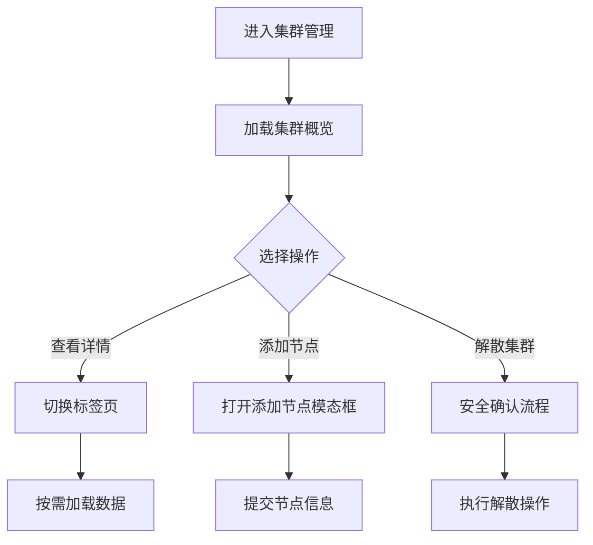
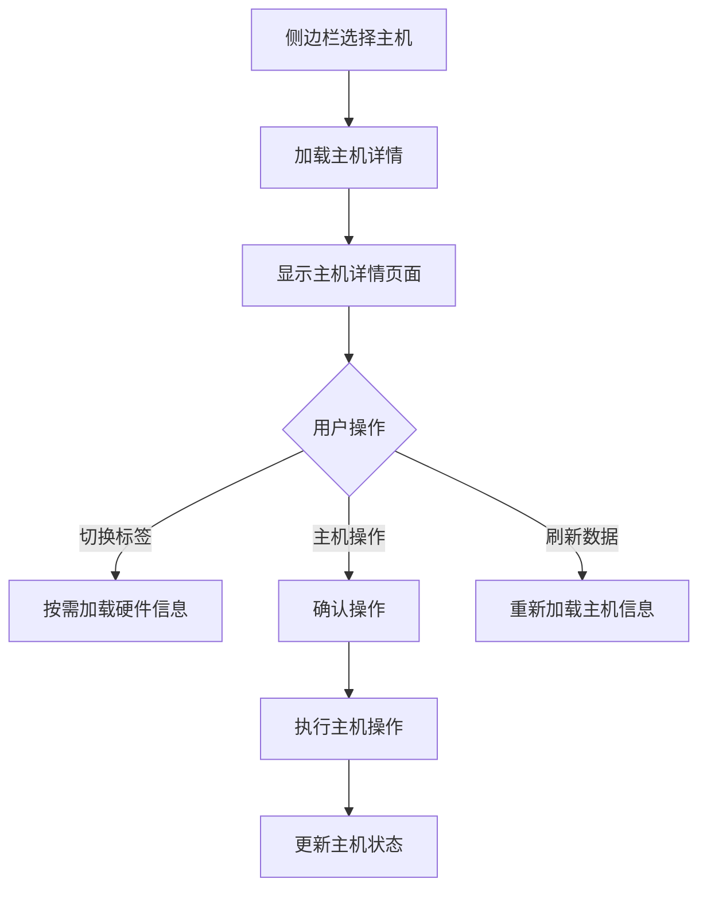

# 集群管理模块技术文档

## 📋 目录

1. [功能概览](#功能概览)
2. [后端API接口分析](#后端api接口分析)
3. [相关依赖模块](#相关依赖模块)
4. [数据流和状态管理](#数据流和状态管理)
5. [技术实现细节](#技术实现细节)
6. [性能优化措施](#性能优化措施)
7. [错误处理机制](#错误处理机制)

---

## 1. 功能概览

### 1.1 核心功能列表

集群管理模块 (`src/pages/Cluster/index.tsx`) 是 KR-virt 虚拟化平台的核心组件，提供以下主要功能：

#### 🏗️ 集群管理功能
- **集群概览**: 显示集群基本信息、节点状态、资源统计
- **物理机列表**: 管理集群中的物理节点，支持添加/移除节点
- **集群资源**: 查看和管理集群资源配置
- **解散集群**: 安全解散整个集群

#### 🖥️ 主机管理功能
- **主机详情**: 查看主机性能指标、系统信息、虚拟机统计
- **主机操作**: 重启、关机、进入/退出维护模式、虚拟机迁移
- **硬件信息**: 按需加载PCI设备、磁盘设备信息
- **性能监控**: CPU、内存、存储、网络性能图表

#### 💻 虚拟机管理功能
- **虚拟机详情**: 查看虚拟机基本配置、硬件配置
- **状态管理**: 虚拟机状态监控和操作
- **控制台访问**: 虚拟机控制台管理

### 1.2 用户界面组件结构

```
ClusterManagement (主组件)
├── 集群管理主页面
│   ├── 页面头部 (标题 + 操作按钮)
│   └── 标签页容器
│       ├── 集群概览 Tab
│       │   ├── 集群基本信息卡片
│       │   ├── 统计信息卡片组
│       │   ├── 节点列表表格
│       │   ├── 资源列表表格
│       │   └── 守护进程状态卡片
│       ├── 物理机列表 Tab
│       │   ├── 统计信息卡片组
│       │   └── 物理机节点表格
│       └── 集群资源 Tab
│           ├── 资源统计概览
│           └── 资源详情表格
├── 主机详情页面 (条件渲染)
│   ├── 页面头部 (主机信息 + 操作按钮)
│   ├── 主机操作卡片
│   └── 详情标签页
│       ├── 基本信息 Tab
│       ├── 性能监控 Tab
│       └── 硬件信息 Tab
└── 虚拟机详情页面 (条件渲染)
    ├── 页面头部 (虚拟机信息 + 操作按钮)
    └── 详情标签页
        ├── 基本信息 Tab
        └── 操作日志 Tab
```

### 1.3 主要业务流程

#### 集群管理流程


#### 主机管理流程


---

## 2. 后端API接口分析

### 2.1 集群管理相关接口

#### 获取集群概览
- **URL**: `GET /cluster/summary`
- **用途**: 获取集群基本信息和统计数据
- **调用时机**: 切换到集群概览标签页时
- **请求参数**: 无
- **响应格式**:
```typescript
interface ClusterSummaryResponse {
  cluster_name: string;           // 集群名称
  stack: string;                  // 技术栈
  dc_node: string;               // DC节点
  dc_version: string;            // DC版本
  dc_quorum: string;             // 仲裁状态
  last_updated: string;          // 最后更新时间
  last_change_time: string;      // 最后变更时间
  last_change_user: string;      // 变更用户
  last_change_via: string;       // 变更方式
  last_change_node: string;      // 变更节点
  nodes_configured: number;       // 配置节点数
  resources_configured: number;   // 配置资源数
  nodes: ClusterSummaryNode[];   // 节点列表
  resources: ClusterSummaryResource[]; // 资源列表
  daemons: Record<string, string>; // 守护进程状态
}
```

#### 获取集群节点列表
- **URL**: `GET /cluster/nodes`
- **用途**: 获取集群中所有物理节点信息
- **调用时机**: 切换到物理机列表标签页时
- **请求参数**: 无
- **响应格式**:
```typescript
interface ClusterNodesResponse {
  cluster_name: string;
  cluster_uuid: string;
  nodes: ClusterNode[];
}

interface ClusterNode {
  name: string;                  // 节点名称
  node_id: string;              // 节点ID
  ip: string;                   // IP地址
  status: string;               // 节点状态
  is_dc: boolean;               // 是否为DC节点
  cpu_total: number | null;     // CPU总量
  mem_total: number | null;     // 内存总量
  cpu_used: number | null;      // CPU使用量
  mem_used: number | null;      // 内存使用量
  pub_key: string;              // SSH公钥
}
```

#### 获取集群资源
- **URL**: `GET /cluster/resources`
- **用途**: 获取集群资源配置信息
- **调用时机**: 切换到集群资源标签页时
- **请求参数**: 无
- **响应格式**:
```typescript
interface ClusterResourcesResponse {
  resources: ClusterResource[];
}

interface ClusterResource {
  id: string;                   // 资源ID
  class_: string;              // 资源类别
  provider: string;            // 提供者
  type: string;                // 资源类型
  attributes: Record<string, string>; // 属性
  operations: ResourceOperation[];    // 操作列表
}
```

### 2.2 节点管理相关接口

#### 获取节点详情
- **URL**: `GET /node/summary`
- **用途**: 获取指定节点的详细信息
- **调用时机**: 选择主机时自动调用
- **请求参数**: `hostname` (查询参数)
- **响应格式**:
```typescript
interface NodeSummaryResponse {
  node_name: string;            // 节点名称
  cluster_name: string;        // 集群名称
  power_state: string;         // 电源状态
  running_time: number;        // 运行时间(秒)
  cpu_total: number;           // CPU总量
  cpu_used: number;            // CPU使用量
  mem_total: number;           // 内存总量(MB)
  mem_used: number;            // 内存使用量(MB)
  disk_total: number;          // 磁盘总量(GB)
  disk_used: number;           // 磁盘使用量(GB)
  storage_total: number;       // 存储总量(GB)
  storage_used: number;        // 存储使用量(GB)
  vms_num: number;             // 虚拟机总数
  running_vm_num: number;      // 运行中虚拟机数
  stopped_vm_num: number;      // 停止虚拟机数
  paused_vm_num: number;       // 暂停虚拟机数
  suspended_vm_num: number;    // 挂起虚拟机数
  error_vm_num: number;        // 异常虚拟机数
  vm_max_allowed: number;      // 最大允许虚拟机数
}
```

#### 节点操作接口
- **重启节点**: `POST /node/reboot`
- **关闭节点**: `POST /node/shutdown`
- **进入维护模式**: `POST /node/maintenance/enter`
- **退出维护模式**: `POST /node/maintenance/exit`
- **请求参数**: `{ hostname: string }`
- **响应格式**: `{ success: boolean; message: string }`

### 2.3 硬件信息相关接口

#### 获取PCI设备信息
- **URL**: `GET /node/pci`
- **用途**: 获取节点PCI设备列表
- **调用时机**: 切换到硬件信息标签页时按需加载
- **请求参数**: `hostname` (查询参数)

#### 获取磁盘设备信息
- **URL**: `GET /node/disks`
- **用途**: 获取节点磁盘设备信息
- **调用时机**: 切换到硬件信息标签页时按需加载
- **请求参数**: `hostname` (查询参数)

### 2.4 集群操作接口

#### 添加节点
- **URL**: `POST /cluster/approve`
- **用途**: 添加新节点到集群
- **请求参数**:
```typescript
interface AddNodeRequest {
  join_ip: string;              // 节点IP
  join_hostname: string;        // 节点主机名
}
```

#### 移除节点
- **URL**: `POST /cluster/remove`
- **用途**: 从集群中移除节点
- **请求参数**: `{ hostname: string }`

#### 解散集群
- **URL**: `POST /cluster/dissolve`
- **用途**: 解散整个集群
- **请求参数**: 无
- **安全措施**: 需要安全确认流程

---

## 3. 相关依赖模块

### 3.1 服务层文件

#### 集群服务 (`src/services/cluster/index.ts`)
```typescript
import { clusterInitService } from "@/services/cluster";

// 主要方法：
- getClusterSummary()          // 获取集群概览
- getClusterNodes()            // 获取集群节点
- getClusterResources()        // 获取集群资源
- getNodeSummary(hostname)     // 获取节点详情
- getNodePCIDevices(hostname)  // 获取PCI设备
- getNodeDiskDevices(hostname) // 获取磁盘设备
- addNode(nodeData)            // 添加节点
- removeNode(nodeData)         // 移除节点
- dissolveCluster()            // 解散集群
- rebootNode(hostname)         // 重启节点
- stopNode(hostname)           // 关闭节点
- enterMaintenanceMode(hostname) // 进入维护模式
- exitMaintenanceMode(hostname)  // 退出维护模式
```

#### 类型定义 (`src/services/cluster/types.ts`)
```typescript
// 导出的主要类型：
- ClusterNodesResponse         // 集群节点响应
- ClusterSummaryResponse       // 集群概览响应
- ClusterResourcesResponse     // 集群资源响应
- NodeSummaryResponse          // 节点详情响应
- NodePCIResponse             // PCI设备响应
- NodeDisksResponse           // 磁盘设备响应
- AddNodeRequest/Response     // 添加节点请求/响应
- RemoveNodeRequest/Response  // 移除节点请求/响应
```

### 3.2 自定义Hooks

#### 侧边栏选择管理 (`src/hooks/useSidebarSelection.ts`)
```typescript
const {
  selectedHost: sidebarSelectedHost,
  selectedVM: sidebarSelectedVM,
} = useSidebarSelection();

// 功能：
- 统一管理侧边栏选择状态
- 自动处理 hierarchical-sidebar-select 事件
- 提供类型安全的状态访问
- 统一的状态清理接口
```

#### 侧边栏刷新管理 (`src/hooks/useSidebarRefresh.ts`)
```typescript
useSidebarRefresh((detail) => {
  if (detail.type === "cluster") {
    fetchRealClusterData();
  }
});

// 功能：
- 监听侧边栏刷新事件
- 支持条件过滤
- 自动清理事件监听器
```

#### 主机操作管理 (`src/hooks/useSidebarHostActions.ts`)
```typescript
useSidebarHostActions((operation, hostname, hostData) => {
  handleNodeOperation(operation, hostname);
});

// 功能：
- 处理侧边栏主机操作事件
- 操作类型标准化映射
- 类型安全的回调接口
```

### 3.3 工具函数

#### 格式化工具 (`src/utils/format.ts`)
```typescript
import {
  formatResourceUsage,    // 格式化资源使用情况
  formatUptime,          // 格式化运行时间
  formatNetworkThroughput, // 格式化网络吞吐量
  formatLoadAverage,     // 格式化负载平均值
  formatPowerState,      // 格式化电源状态
} from "../../utils/format";

// 使用示例：
const cpuUsage = formatResourceUsage(used, total, "核");
const uptime = formatUptime(seconds);
const powerState = formatPowerState(state);
```

#### API助手 (`src/utils/apiHelper.ts`)
```typescript
import { api } from '@/utils/apiHelper';

// 统一的API调用接口：
- 自动错误处理
- 统一响应格式
- Mock数据支持
- 请求拦截和响应拦截
```

### 3.4 UI组件依赖

#### 性能图表组件 (`src/components/ClusterComponent`)
```typescript
import {
  CpuPerformanceChart,     // CPU性能图表
  MemoryPerformanceChart,  // 内存性能图表
  DiskPerformanceChart,    // 磁盘性能图表
  NetworkPerformanceChart, // 网络性能图表
} from "@/components/ClusterComponent";
```

#### 磁盘设备树表组件
```typescript
import DiskDeviceTreeTable from "@/components/DiskDeviceTreeTable";
// 用于显示磁盘设备的层级结构
```

#### 安全确认模态框
```typescript
import SafetyConfirmModal from "@/components/SafetyConfirmModal";
// 用于危险操作的安全确认
```

---

## 4. 数据流和状态管理

### 4.1 状态管理架构

集群管理模块采用 **本地状态管理** 模式，主要使用 React Hooks 进行状态管理：

#### 主要状态分类
```typescript
// 1. 数据状态
const [realClusterData, setRealClusterData] = useState<ClusterNodesResponse | null>(null);
const [clusterSummaryData, setClusterSummaryData] = useState<ClusterSummaryResponse | null>(null);
const [clusterResourcesData, setClusterResourcesData] = useState<ClusterResourcesResponse | null>(null);
const [nodeDetailData, setNodeDetailData] = useState<NodeSummaryResponse | null>(null);

// 2. 加载状态
const [realClusterLoading, setRealClusterLoading] = useState(false);
const [clusterSummaryLoading, setClusterSummaryLoading] = useState(false);
const [nodeDetailLoading, setNodeDetailLoading] = useState(false);

// 3. 错误状态
const [realClusterError, setRealClusterError] = useState<string | null>(null);
const [clusterSummaryError, setClusterSummaryError] = useState<string | null>(null);

// 4. UI状态
const [activeTab, setActiveTab] = useState("overview");
const [hostDetailActiveTab, setHostDetailActiveTab] = useState("basic");
const [addNodeModalVisible, setAddNodeModalVisible] = useState(false);

// 5. 操作状态
const [nodeOperationLoading, setNodeOperationLoading] = useState<string | null>(null);
const [safetyConfirmVisible, setSafetyConfirmVisible] = useState(false);
```

### 4.2 数据获取和更新机制

#### 懒加载策略
```typescript
// 按需加载数据的实现
const loadTabData = useCallback(async (tab: string, force = false) => {
  // 防止重复调用检查
  if (!force && loadingRef.current.has(tab)) {
    return;
  }

  loadingRef.current.add(tab);

  try {
    switch (tab) {
      case "overview":
        await fetchClusterSummaryData();
        break;
      case "list":
        await fetchRealClusterData();
        break;
      case "resources":
        await fetchClusterResourcesData();
        break;
    }
  } finally {
    loadingRef.current.delete(tab);
  }
}, [fetchClusterSummaryData, fetchRealClusterData, fetchClusterResourcesData]);
```

#### API防重复调用机制
```typescript
// 全局API锁机制
const globalApiLockRef = useRef<Set<string>>(new Set());

const withApiLock = useCallback(<T extends unknown[]>(
  apiName: string,
  apiFunc: (...args: T) => Promise<void>
) => {
  return async (...args: T) => {
    if (globalApiLockRef.current.has(apiName)) {
      console.log(`⛔ API ${apiName} 正在执行中，跳过重复调用`);
      return;
    }

    globalApiLockRef.current.add(apiName);
    try {
      await apiFunc(...args);
    } finally {
      globalApiLockRef.current.delete(apiName);
    }
  };
}, []);

// 使用API锁包装的函数
const fetchRealClusterData = useMemo(
  () => withApiLock("fetchRealClusterData", fetchRealClusterDataBase),
  [withApiLock, fetchRealClusterDataBase]
);
```

### 4.3 数据缓存和刷新策略

#### 标签页切换缓存
```typescript
// 防重复调用的标记和Tab追踪
const loadingRef = useRef<Set<string>>(new Set());
const lastActiveTabRef = useRef<string | null>(null);
const tabChangeTimerRef = useRef<NodeJS.Timeout | null>(null);

// 使用防抖策略避免快速切换时的重复调用
useEffect(() => {
  // 清除之前的定时器
  if (tabChangeTimerRef.current) {
    clearTimeout(tabChangeTimerRef.current);
  }

  // 如果Tab没有实际变化，跳过
  if (isInitialized && lastActiveTabRef.current === activeTab) {
    return;
  }

  // 使用防抖延迟执行
  tabChangeTimerRef.current = setTimeout(() => {
    loadTabData(activeTab);
  }, isInitialized ? 50 : 100);

  return () => {
    if (tabChangeTimerRef.current) {
      clearTimeout(tabChangeTimerRef.current);
    }
  };
}, [activeTab, isInitialized, loadTabData]);
```

#### 硬件信息按需加载
```typescript
// 当切换到hardware Tab时，按需加载硬件信息
if (key === "hardware" && sidebarSelectedHost) {
  // 如果还没有PCI设备数据，则加载
  if (!nodePCIData) {
    fetchNodePCIData(sidebarSelectedHost.name);
  }

  // 如果还没有磁盘设备数据，则加载
  if (!nodeDisksData) {
    fetchNodeDisksData(sidebarSelectedHost.name);
  }
}
```

### 4.4 事件驱动的数据同步

#### 侧边栏事件监听
```typescript
// 侧边栏刷新事件处理
useSidebarRefresh((detail) => {
  if (detail.type === "cluster") {
    fetchRealClusterData();
  }
});

// 侧边栏主机操作事件处理
useSidebarHostActions((operation, hostname, hostData) => {
  const validOperations = ["reboot", "stop", "enter_maintenance", "exit_maintenance", "migrate"];
  if (validOperations.includes(operation)) {
    handleNodeOperation(operation, hostname);
  }
});
```

#### 操作后数据刷新
```typescript
// 操作成功后触发刷新事件
if (result.success) {
  message.success(result.message);
  // 刷新物理机列表
  fetchRealClusterData();

  // 触发侧边栏刷新事件
  SidebarRefreshTriggers.cluster("node-added");
}
```

---

## 5. 技术实现细节

### 5.1 组件渲染逻辑

集群管理模块采用 **条件渲染** 模式，根据侧边栏选择状态决定显示内容：

```typescript
const ClusterManagement: React.FC = () => {
  const {
    selectedHost: sidebarSelectedHost,
    selectedVM: sidebarSelectedVM,
  } = useSidebarSelection();

  // 如果选择了主机，显示主机详情页面
  if (sidebarSelectedHost) {
    return <HostDetailPage />;
  }

  // 如果选择了虚拟机，显示虚拟机详情页面
  if (sidebarSelectedVM) {
    return <VMDetailPage />;
  }

  // 默认显示集群管理主页面
  return <ClusterMainPage />;
};
```

### 5.2 状态标签渲染系统

```typescript
// 统一的状态标签渲染函数
const getStatusTag = (status: string) => {
  switch (status) {
    case "running":
      return <Tag icon={<CheckCircleOutlined />} color="success">运行中</Tag>;
    case "healthy":
      return <Tag icon={<CheckCircleOutlined />} color="success">健康</Tag>;
    case "warning":
      return <Tag icon={<ExclamationCircleOutlined />} color="warning">警告</Tag>;
    case "maintenance":
      return <Tag icon={<SyncOutlined spin />} color="processing">维护中</Tag>;
    case "error":
      return <Tag icon={<WarningOutlined />} color="error">错误</Tag>;
    case "online":
      return <Tag color="success">在线</Tag>;
    case "offline":
      return <Tag color="error">离线</Tag>;
    default:
      return <Tag color="default">{status}</Tag>;
  }
};
```

### 5.3 表格列定义系统

#### 物理机节点表格列
```typescript
const realClusterNodesColumns = [
  {
    title: "节点名称",
    dataIndex: "name",
    key: "name",
    render: (name: string, record: ClusterNode) => (
      <div>
        <div style={{ fontWeight: "bold" }}>
          {name}
          {record.is_dc && <Tag color="purple" style={{ marginLeft: "8px" }}>DC</Tag>}
        </div>
        <div style={{ fontSize: "12px", color: "#666" }}>ID: {record.node_id}</div>
      </div>
    ),
  },
  {
    title: "IP地址",
    dataIndex: "ip",
    key: "ip",
    render: (ip: string) => <Tag color="blue">{ip}</Tag>,
  },
  {
    title: "状态",
    dataIndex: "status",
    key: "status",
    render: (status: string) => getStatusTag(status),
  },
  {
    title: "资源使用",
    key: "resources",
    render: (_, record: ClusterNode) => {
      const cpuUsage = formatResourceUsage(record.cpu_used, record.cpu_total, "核");
      const memUsage = formatResourceUsage(record.mem_used, record.mem_total, "GB");

      return (
        <div style={{ fontSize: "12px" }}>
          <div>CPU: <span style={{ color: getProgressColor(cpuUsage.percentage) }}>{cpuUsage.display}</span></div>
          <div>内存: <span style={{ color: getProgressColor(memUsage.percentage) }}>{memUsage.display}</span></div>
        </div>
      );
    },
  },
  // ... 更多列定义
];
```

### 5.4 主机操作处理系统

```typescript
const handleNodeOperation = useCallback(async (
  operation: "reboot" | "stop" | "enter_maintenance" | "exit_maintenance" | "migrate",
  hostname: string
) => {
  const operationNames = {
    reboot: "重启",
    stop: "关机",
    enter_maintenance: "进入维护模式",
    exit_maintenance: "退出维护模式",
    migrate: "迁移虚拟机",
  };

  try {
    // 特殊处理：进入维护模式前检查虚拟机状态
    if (operation === "enter_maintenance") {
      const canEnter = checkCanEnterMaintenance(hostname);
      if (!canEnter) {
        modal.warning({
          title: "无法进入维护模式",
          content: "该节点上还有运行中的虚拟机，请先关闭或迁移虚拟机后再进入维护模式。",
        });
        return;
      }
    }

    modal.confirm({
      title: `确认${operationNames[operation]}`,
      content: `您确定要对节点 ${hostname} 执行${operationNames[operation]}操作吗？`,
      onOk: async () => {
        setNodeOperationLoading(operation);

        let result;
        switch (operation) {
          case "reboot":
            result = await clusterInitService.rebootNode(hostname);
            break;
          case "stop":
            result = await clusterInitService.stopNode(hostname);
            break;
          case "enter_maintenance":
            result = await clusterInitService.enterMaintenanceMode(hostname);
            break;
          case "exit_maintenance":
            result = await clusterInitService.exitMaintenanceMode(hostname);
            break;
          default:
            return;
        }

        if (result.success) {
          message.success(result.message);
          // 操作成功后刷新节点详情
          setTimeout(() => {
            fetchNodeDetailData(hostname);
          }, 2000);
        } else {
          modal.error({
            title: `${operationNames[operation]}失败`,
            content: result.message,
          });
        }

        setNodeOperationLoading(null);
      },
    });
  } catch (error) {
    console.error(`Error in handleNodeOperation:`, error);
    setNodeOperationLoading(null);
  }
}, [checkCanEnterMaintenance, fetchNodeDetailData, modal, message]);
```

### 5.5 安全确认流程

```typescript
// 安全确认模态框配置
const getSafetyConfirmProps = useCallback(() => {
  if (!pendingAction) return null;

  switch (pendingAction.type) {
    case "removeNode":
      return {
        title: "确认移除节点",
        description: `您即将从集群中移除节点 "${pendingAction.data.nodeName}"。此操作将会影响集群的可用性，请确保该节点上没有重要的运行中虚拟机。`,
        confirmText: `remove ${pendingAction.data.nodeName}`,
        warning: "移除节点是不可逆操作，移除后节点上的数据将无法恢复。请确保已备份重要数据。",
        confirmButtonText: "移除节点",
      };
    case "dissolveCluster":
      return {
        title: "确认解散集群",
        description: "您即将解散当前集群。此操作将清除所有集群配置和数据。",
        confirmText: "dissolve cluster",
        warning: "解散集群是极其危险的操作，所有数据将被永久删除且无法恢复。请确保已备份所有重要数据。",
        confirmButtonText: "解散集群",
      };
    default:
      return null;
  }
}, [pendingAction]);

// 安全确认处理函数
const handleSafetyConfirm = useCallback(() => {
  if (!pendingAction) return;

  switch (pendingAction.type) {
    case "removeNode":
      if (pendingAction.data.hostname && pendingAction.data.nodeName) {
        executeRemoveNode(pendingAction.data.hostname, pendingAction.data.nodeName);
      }
      break;
    case "dissolveCluster":
      executeDissolveCluster();
      break;
    default:
      setSafetyConfirmVisible(false);
      setPendingAction(null);
  }
}, [pendingAction, executeRemoveNode, executeDissolveCluster]);
```

---

## 6. 性能优化措施

### 6.1 懒加载和按需加载

#### 标签页懒加载
```typescript
// 只有在用户切换到特定标签时才调用API
const [loadedTabs, setLoadedTabs] = useState(new Set(['overview']));

const handleTabChange = (key: string) => {
  setActiveTab(key);
  if (!loadedTabs.has(key)) {
    // 首次访问该标签，加载数据
    loadTabData(key);
    setLoadedTabs(prev => new Set([...prev, key]));
  }
};
```

#### 硬件信息按需加载
```typescript
// 当切换到hardware Tab时，按需加载硬件信息
if (key === "hardware" && sidebarSelectedHost) {
  // 如果还没有PCI设备数据，则加载
  if (!nodePCIData) {
    fetchNodePCIData(sidebarSelectedHost.name);
  }

  // 如果还没有磁盘设备数据，则加载
  if (!nodeDisksData) {
    fetchNodeDisksData(sidebarSelectedHost.name);
  }
}
```

### 6.2 防抖和节流优化

#### Tab切换防抖
```typescript
// 使用防抖策略避免快速切换时的重复调用
tabChangeTimerRef.current = setTimeout(() => {
  if (!isInitialized) {
    setIsInitialized(true);
  }
  loadTabData(activeTab);
}, isInitialized ? 50 : 100); // 初始化时延迟更长
```

#### API调用防重复
```typescript
// 全局API防重复调用机制
const globalApiLockRef = useRef<Set<string>>(new Set());

const withApiLock = useCallback(<T extends unknown[]>(
  apiName: string,
  apiFunc: (...args: T) => Promise<void>
) => {
  return async (...args: T) => {
    if (globalApiLockRef.current.has(apiName)) {
      console.log(`⛔ API ${apiName} 正在执行中，跳过重复调用`);
      return;
    }

    globalApiLockRef.current.add(apiName);
    try {
      await apiFunc(...args);
    } finally {
      globalApiLockRef.current.delete(apiName);
    }
  };
}, []);
```

### 6.3 内存优化

#### 组件卸载时清理
```typescript
useEffect(() => {
  return () => {
    // 清理定时器
    if (tabChangeTimerRef.current) {
      clearTimeout(tabChangeTimerRef.current);
    }

    // 清理API锁
    globalApiLockRef.current.clear();
  };
}, []);
```

#### 大数据量表格优化
```typescript
// 表格分页配置
pagination={{
  pageSize: 10,
  showSizeChanger: true,
  showQuickJumper: true,
  showTotal: (total, range) => `第 ${range[0]}-${range[1]} 条/共 ${total} 条`,
}}

// 表格滚动配置
scroll={{ x: 800 }}
```

### 6.4 渲染优化

#### 条件渲染优化
```typescript
// 使用条件渲染避免不必要的组件创建
if (sidebarSelectedHost) {
  return <HostDetailPage />;
}

if (sidebarSelectedVM) {
  return <VMDetailPage />;
}

return <ClusterMainPage />;
```

#### 状态更新优化
```typescript
// 批量状态更新
const updateNodeDetailState = useCallback((data: NodeSummaryResponse) => {
  setNodeDetailData(data);
  setNodeDetailError(null);
  setNodeDetailLoading(false);
}, []);
```

---

## 7. 错误处理机制

### 7.1 API错误处理

#### 统一错误处理模式
```typescript
const fetchClusterSummaryDataBase = useCallback(async () => {
  const timestamp = new Date().toLocaleTimeString();
  setClusterSummaryLoading(true);
  setClusterSummaryError(null);

  try {
    console.log(`📡 [${timestamp}][API Call] 开始调用集群概览API`);
    const result = await clusterInitService.getClusterSummary();

    if (result.success && result.data) {
      setClusterSummaryData(result.data);
      console.log(`✅ [${timestamp}][API Success] 获取集群概览数据成功`);
    } else {
      console.error(`❌ [${timestamp}][API Error] 获取集群概览数据失败:`, result.message);
      setClusterSummaryError(result.message);
      message.error(result.message);
    }
  } catch (error) {
    console.error(`❌ [${timestamp}][API Exception] 获取集群概览数据异常:`, error);
    const errorMessage = "获取集群概览数据失败，请稍后重试";
    setClusterSummaryError(errorMessage);
    message.error(errorMessage);
  } finally {
    setClusterSummaryLoading(false);
    console.log(`🏁 [${timestamp}][API Complete] 集群概览API调用完成`);
  }
}, [message]);
```

#### 错误状态显示
```typescript
// 错误状态的UI展示
{clusterSummaryError ? (
  <div style={{ textAlign: "center", padding: "50px" }}>
    <Alert
      message="获取集群概览数据失败"
      description={clusterSummaryError}
      type="error"
      showIcon
      action={
        <Button
          type="primary"
          onClick={fetchClusterSummaryData}
          icon={<SyncOutlined />}
        >
          重新加载
        </Button>
      }
    />
  </div>
) : (
  // 正常内容
)}
```

### 7.2 操作错误处理

#### 主机操作错误处理
```typescript
try {
  // 在用户确认后才设置loading状态
  setNodeOperationLoading(operation);

  let result;
  switch (operation) {
    case "reboot":
      result = await clusterInitService.rebootNode(hostname);
      break;
    // ... 其他操作
  }

  if (result.success) {
    message.success(result.message || `${operationNames[operation]}操作成功`);
    // 操作成功后刷新节点详情
    setTimeout(() => {
      fetchNodeDetailData(hostname);
    }, 2000);
  } else {
    modal.error({
      title: `${operationNames[operation]}失败`,
      content: result.message || `${operationNames[operation]}操作失败`,
    });
  }
} catch (error) {
  console.error(`${operation} operation failed:`, error);
  modal.error({
    title: "操作失败",
    content: `${operationNames[operation]}操作执行失败`,
  });
} finally {
  setNodeOperationLoading(null);
}
```

### 7.3 网络错误处理

#### 网络连接检查
```typescript
// 在API调用失败时提供网络连接提示
catch (error) {
  console.error(`❌ [${timestamp}][API Exception] 获取数据异常:`, error);

  let errorMessage = "获取数据失败，请稍后重试";

  // 检查是否为网络错误
  if (error.message.includes('Network Error') || error.message.includes('fetch')) {
    errorMessage = "网络连接失败，请检查网络连接后重试";
  }

  setError(errorMessage);
  message.error(errorMessage);
}
```

### 7.4 用户输入验证

#### 表单验证
```typescript
// 添加节点表单验证
<Form.Item
  label="节点IP地址"
  name="join_ip"
  rules={[
    { required: true, message: "请输入节点IP地址" },
    {
      pattern: /^(?:(?:25[0-5]|2[0-4][0-9]|[01]?[0-9][0-9]?)\.){3}(?:25[0-5]|2[0-4][0-9]|[01]?[0-9][0-9]?)$/,
      message: "请输入有效的IP地址格式"
    }
  ]}
>
  <Input placeholder="例如: 192.168.1.100" />
</Form.Item>

<Form.Item
  label="节点主机名"
  name="join_hostname"
  rules={[
    { required: true, message: "请输入节点主机名" },
    {
      pattern: /^[a-zA-Z0-9]([a-zA-Z0-9\-]{0,61}[a-zA-Z0-9])?$/,
      message: "主机名格式不正确"
    }
  ]}
>
  <Input placeholder="例如: node-02" />
</Form.Item>
```

### 7.5 边界情况处理

#### 空数据处理
```typescript
// 空数据状态展示
{realClusterData && realClusterData.nodes.length > 0 ? (
  <Table
    columns={realClusterNodesColumns}
    dataSource={realClusterData.nodes}
    // ... 其他配置
  />
) : (
  <div style={{ textAlign: "center", padding: "50px" }}>
    <Alert
      message="暂无物理机数据"
      description="点击下方按钮获取最新的物理机节点信息"
      type="info"
      showIcon
      action={
        <Button
          type="primary"
          onClick={fetchRealClusterData}
          icon={<SyncOutlined />}
        >
          获取数据
        </Button>
      }
    />
  </div>
)}
```

#### 权限检查
```typescript
// 检查节点是否可以进入维护模式
const checkCanEnterMaintenance = useCallback((hostname: string): boolean => {
  try {
    // 使用节点摘要数据来检查，避免调用不存在的checkNodeStatus接口
    if (nodeDetailData && nodeDetailData.node_name === hostname) {
      return nodeDetailData.running_vm_num === 0;
    }

    // 如果没有节点详情数据，则直接允许进入维护模式
    // 后端会在实际操作时进行检查
    console.warn(`没有找到节点 ${hostname} 的详情数据，允许尝试进入维护模式`);
    return true;
  } catch (error) {
    console.error("检查节点状态失败:", error);
    // 出错时也允许尝试，让后端来决定是否可以进入维护模式
    return true;
  }
}, [nodeDetailData]);
```

---

## 8. 总结

### 8.1 架构优势

1. **模块化设计**: 清晰的组件分离和职责划分
2. **类型安全**: 完整的TypeScript类型定义
3. **性能优化**: 懒加载、防抖、API锁等优化措施
4. **错误处理**: 完善的错误处理和用户反馈机制
5. **可维护性**: 统一的代码风格和注释规范

### 8.2 技术特色

1. **Hook架构**: 使用自定义Hook简化状态管理
2. **事件驱动**: 基于事件的组件间通信
3. **条件渲染**: 根据状态动态切换页面内容
4. **安全机制**: 危险操作的安全确认流程

### 8.3 扩展建议

1. **虚拟化优化**: 对于大数据量表格可考虑虚拟滚动
2. **缓存策略**: 可以添加更智能的数据缓存机制
3. **实时更新**: 可以考虑WebSocket实时数据更新
4. **国际化**: 支持多语言界面

---

*本文档基于 KR-virt 项目 v0.0.0 版本编写，最后更新时间：2025年6月24*
```
```